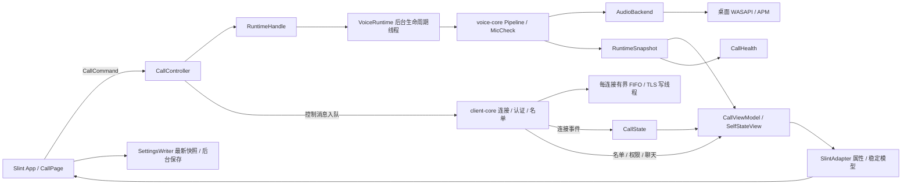

# #41 通话页重建与语音 / GUI 分离实施记录

日期：2026-10-03。基于本地 #45 改动继续实现；保留其平台条件编译、便携内核与 Linux CI 工作。
本轮源码已接入实际客户端，原生离线预览用于布局验收。实际声卡、多人会话、跨屏 DPI 和发布构建仍待验收。

## 已实现的边界



- `client-core` 保持连接、认证、频道、聊天与名单逻辑。认证后的控制消息通过每连接有界 FIFO 后台写入；按钮不等待 TLS 写锁，断开可立即中断 socket。消息数 / 字节预算耗尽时进入明确的连接恢复路径。
- 新建 `client-runtime`：不依赖 Slint、不导入 Windows 音频 API；集中管理 DNS、APM 准备、语音 / 试麦替换、后台线程回收、状态投影与恢复策略。
- `voice-core` 保留编解码、加密 UDP、门控和混音；新增可克隆的 `PipelineControl` / `MicCheckControl`，控制句柄析构不等待线程。
- `client/src/platform_audio.rs` 只提供桌面设备和 APM 工厂。设备工厂、首次使用、后续读写与最终释放在相同音频线程执行。
- `client-runtime/src/call/` 提供普通 Rust `CallState`、`CallController`、`CallViewModel`；连接阶段不从 GUI 读回，操作规则不依赖窗口。`project_audio()` 保留电平 / 活动的高频路径。
- `client/src/call/adapter.rs` 统一同步通话属性、名单、成员菜单和石座，保留 `ModelRc`，只通知变化的行。Slint 不再推断恢复提示、状态文案或发送掩码。
- `client/src/main.rs` 持命令句柄、连接阶段和快照，负责回调 / 事件桥接及桌面集成，不持有 Pipeline / MicCheck 的线程所有者。首页、设置、扫描、身份与热键仍由平台侧接线。

轻量架构和边界详见 [通话 UI 架构](client-ui-architecture.md)。

其他平台可提供自己的 `AudioBackend`，复用连接和运行层。热键、身份存储、设备枚举、窗口与托盘仍需要对应平台适配；本轮不表示其他平台客户端已可发布。
新运行层保持客户端 GPL 许可，迁移的恢复策略保留原许可；现有 MPL 引擎和 `client-core` 的许可未改动。

## 通话页

`App` 保留首页、加入和设置路由。通话页拆到 `ui/call/`：Header、ChannelNavigator、RecoverySummary、ChatPane、DiagnosticsPane、SelfDock、OverlayHost 和通话基础控件。

SelfDock 只有一个宿主实例，占独立布局行：身份、麦克风输入、模式 / 状态、操作四组。底栏自身以 736px 为断点切换两行；导航以 640px 为断点切换。分隔线参与布局，不自由悬放在文字 / 按钮上。
最小窗口为 400×360。长昵称、按键名按各自空间截断；完整成员名字通过宿主菜单查看。轮廓按钮支持点击、Tab 和 Space，成员菜单支持 Esc 与回到原入口。
模式与身份弹层关闭后也回到原底栏入口；设置页将输入是否过阈值、离线试麦和实际语音发送分别表达。

官方篝火继续使用原 Stage、石座图、SeatMap 和动效节流。`ui/scenes/host.slint` 接收成员、发送状态、视口和统一几何，只输出成员操作意图。
`campfire::seat_geometry` 提供石座中心、尺寸和标签方向，Rust 图像与 Slint 命中区域不再重复座位公式。尺寸不足时使用可滚动成员视图。
场景私有成员卡片移除，频道名单与石座共用应用菜单；成员按会话 ID 校验，新连接 / 重连关闭旧菜单。侧栏键盘选择按成员 / 频道 ID 与类型保持目标。

## 状态与生命周期

输入电平、说话方式、成功提交语音包的事实分别投影。VAD 的 200ms 尾音由引擎实际发送状态体现；PTT 按下不会直接点亮 GUI 发送灯。
采集、播放和传输错误分开记录。单独播放失败时，仍可显示麦克风在发送；闭麦时输入电平继续可观察。底栏、自我名单行和石座消费同一状态投影。

本地闭麦 / 关闭声音意愿独立于服务端回包；协议没有意愿版本确认，旧名单刷新不能覆盖较新的点击。管理员禁言作为独立约束。关闭声音同时闭麦，重新打开声音保持闭麦。

每次开始 / 停止都有本地请求代次。过期准备任务不提交结果；候选 Pipeline 在线程启动前注入初始状态，接受前禁止语音包和 UDP 保活。接受时重新应用最新意愿与成员音量。
设备替换沿用同一密钥的 `VoiceSequences`；新的 TCP 会话使用新密钥和序号，清除旧成员 ID 音量映射。旧 Stop 或告别音延迟任务不能停止更新的会话。

DNS、APM、音频线程 join 在后台 worker；静音、PTT 松开和传输暂停经轻控制句柄立即作用。离开与设置页关闭不在 GUI 等待音频回收。
扫描仅在离线时可用，先在后台等旧试麦归还设备；逐设备 / 帧检查取消。进入通话、换设备、关闭设置或退出取消旧扫描，扫描释放设备后才允许最新音频请求开启。完成时重新检查当前会话和页面，不恢复过期设置。
设置保存采用单后台线程和单个待写快照，连续修改合并为最新完整值；磁盘写入不持 GUI 状态锁。退出时先停止事件循环，再有界等待音频退场和最后一次设置保存。

恢复退避与通知去重策略迁到 `client-runtime` 并复用原行为。健康恢复要求设备与认证 UDP 探测就绪，TCP 重连成功不直接视为语音已恢复。

## 性能诊断

设备枚举移到后台，采用代次丢弃旧列表。宽 / 高通知合并成一次事件循环场景重建；石座继续使用既有缓存。前台状态约 50ms、隐藏状态约 500ms，同原动效节流策略配合。

诊断页显示本地 UI 阶段和 `RuntimeTimings`：队列等待、旧实例回收、DNS、APM、Pipeline 启动，以及请求提交到首次成功采集 / 播放 / UDP 就绪的时间。
UI 阶段记录 App 创建、加入结果到通话状态投影、场景底图重建和设备枚举。它们是阶段耗时，不能当作第一帧耗时、帧率或 p95 达标证据。
`GOUHUO_TRACE_UI=1` 可额外向 stderr 输出 UI 阶段。记录仅包含阶段 / 耗时，不含密钥、邀请码、聊天或原始音频。

## 运行预览

```powershell
cargo run -p client --example call_ui_window --offline
cargo run -p client --example call_ui_software_window --offline
cargo run -p client --example call_ui_preview --offline
```

两个原生入口分别使用默认与 `winit-software` 渲染。F1：760×520；F2：400×360；F3：轮换状态；F4：成员菜单。
预览不连接服务器、不创建身份、不占用音频设备、不读写用户设置、不接单实例锁。
无窗口的 `call_ui_preview` 生成 `docs/design/rebuild/` 的几何 / 状态图片和 `offline-scene-timings.csv`；图片与计时属于离线 fixture。

## 验证记录

本机 Windows / MSVC，Rust 1.96.0，Slint 1.18.1，debug 构建。

| 检查 | 实际结果 |
|---|---|
| `cargo test -p voice-core -p client-core -p client-runtime -p client --offline` | 351 项通过，12 项声卡 / 外网 / 性能 / 系统注入专项忽略 |
| `client-runtime` | 30 项通过，包括 8 项纯 CallViewModel、4 项真实 TLS CallController 回归，以及 Opus / 加密 UDP 配合可控设备工厂的生命周期竞态 |
| SlintAdapter | 模型身份 / 类型 ID 回归，以及真实投影到 Slint 的状态、音量、焦点、聊天已读、重连、离线试麦集成回归通过 |
| `client-core` voice_pipeline | 23 项通过，1 项真实声卡测试忽略 |
| 控制面写队列 | 实际 TLS 写锁占用下及时返回、意愿 / FIFO 顺序、立即关闭、消息数 / 字节预算检查通过 |
| 设置保存 | 26 项设置测试通过；受控阻塞磁盘、最新快照合并、关闭 flush 与错误恢复通过 |
| `cargo clippy --workspace --all-targets --offline -- -D warnings` | 通过 |
| `cargo fmt --all --check`、SPDX、`git diff --check` | 通过 |
| `cargo build -p client --bin gouhuo --offline` | 实际客户端 debug 二进制构建通过 |
| 引擎无默认 feature / 仅 pipeline feature | 编译通过；本机未安装其他平台 Rust target |
| Windows 原生默认渲染 | 已检查 760×520、400×360、底栏点击、冷启动 F2、石座成员菜单、Esc 回同一成员；身份 Esc / Space 重开 / 关闭回入口；当前 DPI 最大化与还原后的稳定帧 |
| Windows 原生软件渲染 | 已检查 760×520、400×360、冷启动 F2、模式菜单 / Esc / Space 重开 / PTT 选择与回入口 |
| 软件渲染矩阵 | 10 组逻辑尺寸 × 4 倍率；20 状态 × 2 尺寸，附指针 / 键盘断言 |

软件倍率覆盖 100 / 125 / 150 / 200%，包括 639 / 640 / 641 与 735 / 736 / 737 边界；这不等于原生跨屏 DPI 验收。
状态覆盖 VAD / PTT、未绑键、闭麦、关闭声音、重连、三方向故障、长昵称 / 键名、1 / 8 / 12 人、成员菜单、聊天、诊断与导航。
最终软件矩阵附模式 / 身份弹层的双尺寸焦点断言。原生默认 / 软件截图保存为 `docs/design/rebuild/native-default-*.png` 与 `native-software-*.png`。
轻量 ViewModel 接线后的最终 80 组矩阵再次通过；矩阵与附加交互 / 焦点图共 91 张与接线前逐一比较 SHA-256，全部相同。另行生成于 `target/call-architecture-preview/`，未覆盖原设计图片与下述性能记录。

离线 fixture 的 174 次独立场景阶段记录：Stage CPU 中位 3.556ms、最大 18.154ms；几何 / 石座中位 0.036ms、最大 4.266ms。来源为 `offline-scene-timings.csv`，不含原生第一帧、音频准备或网络，不能用于宣称入页性能已经达标。

## 仍待验收

- Windows 原生不同 DPI 与跨屏拖动、连续缩放；最大化 / 恢复仅在当前 DPI 检查。
- 真实声卡、PTT 热键、换设备、多人会话、断网恢复、托盘与游戏全屏。
- Release / dist 冷热入页、帧耗时、CPU / RSS 与原版本对照，及安装包实际启动。
- Linux CI 已包含新运行层，尚未从本机触发远端执行；其他平台音频后端未实现。

源码与离线预览已经可运行；上述项目完成前，不将整个 #41 或跨平台客户端标为验收完成。
