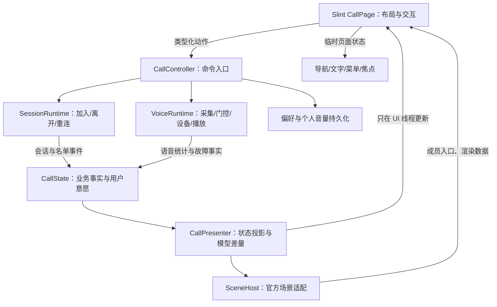

# #41 通话页重建方案：布局、状态与 UI 架构

日期：2026-10-02。最近修订：2026-10-03。状态：**实施中**。代码与验收记录见 [实施记录](call-ui-rebuild-implementation.md)。

范围修订：官方像素篝火已经存在，本轮复用现有实现。草图指导页面布局和自身底栏，不要求重新制作篝火美术。

本方案以已确认的「第一版主体 + 第三版自身底栏」为视觉目标，取代上一轮实现计划。
上一轮客户端代码已回滚；`design/implemented/` 中的图片和旧文档的通过记录仅是历史材料，
不能作为本方案完成、原生窗口可用或性能达标的证据。以下保留设计规格；实际验证单独记录。

## 1. 要做成什么样

让用户进入一个可以长时间停留的通话空间：左侧找到频道和人，中间围着像素篝火，
底部始终知道自己是谁、麦克风有没有输入、怎样说话、是否真的正在发送。
闭麦和关闭声音要稳定、直接；换频道、看文字、查看异常都不能把这两个操作藏起来。

视觉基准：

- [选定布局](design/call-layout-selected-v1.png)：主体用第一版，自身底栏参考第三版。
- [应用与场景的边界](design/call-scene-boundaries-v1.png)：导航、标题、异常、底栏和成员菜单由应用管理。
- [状态草图](design/call-states-v1.png)、[窄窗口与恢复草图](design/call-narrow-recovery-v1.png)：作为状态覆盖清单。
- [修改前实际界面](design/baseline/normal.png)：用于比较操作变化，不作为新视觉目标。

现有客户端已经具备官方像素篝火、程序生成石座、说话响应和火光动效。
草图中的森林背景和头像不作为本轮必须新增的场景资源；页面布局和自身底栏按已选草图落实。
生成图里的错误也不照搬：正常闭麦动作不一直显示红色划线图标；绿色只表示实际发送或成员说话；
只有自己时频道人数是 1，不是 0；未绑定 PTT 键时不会显示发送中。

### 本轮范围

| 必须完成 | 边界 |
|---|---|
| 通话页面重构 | 正常、窄、最小高度，侧栏、标题、文字、恢复提示、自身底栏 |
| 自身状态 | 输入、模式、发送事实分开；闭麦、关闭声音、PTT 绑定沿用现有能力 |
| 成员操作 | 名单和场景共用菜单；音量、本地静音、权限允许的管理操作 |
| 官方像素篝火接入 | 复用现有 renderer、石座、座位分配与节流；适配新布局、宿主菜单和状态接口 |
| 架构与性能 | 清楚的视图、状态、命令和场景边界；进入页面及缩放可测量 |
| 原生验收 | Windows 默认渲染、软件回退、DPI、键盘、真实设备与会话 |

首页、加入流程和设置页不在本轮视觉重做范围内。协议、服务端、账号体系不扩展。
社区场景包本轮建立接口边界；安装、市场、任意代码插件和上传分发单独立项。

## 2. 上一轮暴露的问题与处理原则

| 问题 | 已有证据 | 本轮处理 |
|---|---|---|
| 底栏分隔线穿过内容 | 原生窗口可见；撤回代码中细线没有显式定位，Slint 默认将无坐标子元素居中 | 分隔线占一个独立布局行；不在控件上自由悬放 |
| 草图底栏变成拼接按钮和文字 | 撤回截图没有忠实保留身份、输入、模式/状态、操作四组的视觉关系 | 先独立制作 SelfDock，逐项对照草图，确认后再接通业务 |
| 临界宽度和长内容缺少空间规则 | 原先主要检查 760/400，侧栏与底栏共享窄态；长按键名会增加内容最小宽度 | 分开布局断点；定义每组最小空间、截断、紧凑名称和换行规则 |
| 进入通话时短暂停顿 | 用户实际反馈存在；尚无各阶段耗时或 release 对照 | 先测量，候选包括 DNS/APM、线程回收、场景预热/尺寸重建；不得预先定因 |
| 发送状态来自多个 UI 写入点 | 回滚源码中 PTT 轮询和状态轮询共同写 transmitting，VAD 按电平猜测 | 语音引擎提供事实，统一投影，所有 UI 只读同一个发送状态 |
| 测试通过被误当成完成 | 软件 PNG 和 Rust 测试无法证明原生布局、DPI 或实际操作达标 | 验收分层，必须有原生证据和草图对照；不以通过数量代替交付质量 |
| 改动同时涉及布局、公共样式、语音生命周期 | 出问题时难以判断来自哪一层 | 每阶段可独立预览、验证、撤回；公共 Theme 不一次影响首页和设置 |

注意：WASAPI 的实际设备打开发生在音频线程的 read/write 路径中。
不能把“所有声卡初始化都在 UI 线程”当作卡顿结论。

## 3. 页面布局与响应式规则

以下数值都是第一轮原生布局的**初始规格**，不是实测结果。尺寸采用 Slint 逻辑像素，
窗口规格指客户区，不包含系统标题栏；DPI 改变物理像素，不改变这些逻辑尺寸。

### 3.1 正常窗口

默认客户区 760 × 520，最小客户区沿用 400 × 360。

```text
┌────────────────────┬────────────────────────────────────────┐
│ 服务器与频道        │ 通话标题：服务器 / 频道、人数、文字、离开 │
│                    ├────────────────────────────────────────┤
│ 频道列表            │ 异常提示（仅异常时出现）                  │
│                    ├────────────────────────────────────────┤
│ 当前频道成员        │                                        │
│                    │ 场景 / 文字 / 诊断                        │
│                    │                                        │
├────────────────────┴────────────────────────────────────────┤
│ 身份 │ 麦克风输入 │ 模式 + 发送状态 │ 闭麦 │ 声音 │ 设置       │
└─────────────────────────────────────────────────────────────┘
```

正常侧栏初始宽 208px，标题初始高 56px；主体高度伸缩；底栏初始高 80px。
底栏跨整个客户区，放在侧栏和主区域共同父级的最后一行。
侧栏内部滚动只影响名单，主区域滚动只影响文字/诊断，均不移动底栏。

### 3.2 分开计算三个布局选择

| 选择 | 初始规则 | 目的 |
|---|---|---|
| 导航布局 | 宽度 ≥640：侧栏常驻；<640：频道导航替换主体 | 主区域要有足够宽度 |
| 底栏布局 | 宽度 ≥736：单行四组；<736：信息一行、操作一行 | 每组有足够空间，不能等侧栏隐藏后才换行 |
| 场景密度 | 场景可用高度 ≥160：完整石座场景；<160：紧凑成员视图和简化火光 | 最矮窗口不能硬塞八座、名字和恢复提示 |

具体断点以原生字体测量为准，定稿前可以调整；三项独立，不能合成一个 `narrow` 布尔值。
特别要验收 639/640/641 与 735/736/737，包含有异常、长昵称和长按键名的情况。

### 3.3 自身底栏：忠实保留四组关系

**身份组**：本地生成的头像/身份图形、昵称、“我”。昵称单行截断，完整昵称在身份详情或提示中可读。
不引入上传头像、头像服务器或新协议；第一版可用身份 seed 生成稳定的小图形。

**输入组**：麦克风图标、“输入”标签、细分段或细条电平、VAD 阈值刻线。
输入颜色采用中性或暖色；PTT 模式不显示 VAD 刻线。输入不可用时明确写出，不显示冻结旧电平。

**说话组**：第一行模式，第二行发送状态。普通模式是紧凑文本入口，
不做成占满剩余空间的大按钮；点击可切换 VAD/PTT，细项继续进入设置。
PTT 未绑键时在该组内显示绑定入口，不替换掉闭麦和声音按钮。

**操作组**：闭麦/开麦、关闭/打开声音、设置。外形参考草图的紧凑轮廓按钮，
图标与文字对齐；禁用必须可解释。底栏各组之间用细竖线和间距，不用横线穿过内容。

单行最小宽度预算：身份 120、输入 136、模式/状态 136、操作 272，组间总间距 48，
内部合计 712px，加左右各 12px，恰好需要客户区 736px。
760px 时多出的 24px 可分配给模式/状态；不足 736px 直接进入两行，不依靠负空间挤压。
这些是最小预算；原生字体或边框使预算不足时提高断点，实际组件用布局约束表达，不逐项计算绝对 x 坐标。

两行底栏初始高 112px：

```text
头像 + 昵称（我） │ 输入电平 │ 模式 / 发送状态
───────────────────────────────────────────
    闭麦/开麦     │   关闭/打开声音    │ 设置
```

第一行长昵称截断，长按键名使用统一的短名称映射，完整名称可查看；状态文本不允许推挤第二行。
第二行两个主要开关高至少 40px，宽度稳定；设置只显示图标，但具备明确的无障碍名称。

### 3.4 最小窗口与异常

400 × 360 下，标题最多使用两行，总高初始 80px；底栏 112px。
异常摘要初始最多 72px，只放一句原因和主要恢复动作；详细原因打开宿主详情层。
如果剩余场景高度不足，使用紧凑成员视图，不能压缩底栏或让按钮滑出窗口。

窄态频道导航打开时替换主体内容，顶部有“返回通话”，底栏保留。
文字和诊断也使用主体区域；异常摘要仍由宿主管理，不能被某个场景或文字视图隐藏。
退出通话仍是明确的“离开”动作，返回、Esc、关闭菜单均不离开。

### 3.5 Slint 布局约束

- 页面只由最外层 VerticalLayout 分配“主体 + 底栏”；主体再按导航布局组织。
- UI 控件区使用 GridLayout/HorizontalLayout/VerticalLayout；绝对坐标仅用于场景图形和浮层锚点。
- 分隔线作为独立布局元素，或明确 x/y 的装饰，不使用默认居中位置。
- 固定尺寸与 min/max/preferred 约束择一表达，不给同一轴叠加冲突约束。
- 文字必须有溢出规则；能截断的区域允许收缩，不能把文本的自然宽度当永久最小宽度。
- 状态与文案变化不能改变底栏高度；两种底栏布局共用状态和动作，只改变排列。
- 实际字体和两种渲染后端均要验证，不把软件渲染 1×当作原生几何的替代。

Slint 的默认坐标会将未定位的子元素置于父级中央，布局还会传播子级尺寸约束。
上述规则依据[官方布局说明](https://docs.slint.dev/latest/docs/slint/guide/language/coding/positioning-and-layouts/)。
仓库当前 Cargo.lock 锁定 Slint 1.18.1；实现以该版本编译和原生行为为准，本轮不升级框架。

### 3.6 视觉规格与资源

| 项目 | 初始规格 |
|---|---|
| 基础表面 | 深色 #16171b；面板 #1b1d22；控件 #23262d；边界 #2e323a |
| 文本 | 正文 #e6e8ec，次级 #868c96；重要状态不用更暗的装饰文字色 |
| 强调 | 暖色 #e7ad58，深色按钮文字；绿色 #3fbf6d 仅用于发送/说话；故障 #e05a52；恢复 #d9a441 |
| 字体 | 中文 Microsoft YaHei UI；系统字体回退单独验收；标题 18/20px，正文 14px，辅助 12px |
| 间距 | 4/8/12/16/24px；组内 8px，组间初始 16px；各组按同一基线对齐 |
| 控件 | 8px 圆角，普通动作高 36px，底栏主要开关高 40px；输入细条不伪装成按钮 |
| 图标 | 单一线条 SVG 系列、统一 18/20px；不用 emoji 充当可操作图标；许可随资源保存 |
| 焦点 | 2px 可见边框，独立于说话高亮；禁用有文本解释，不仅降低透明度 |
| 动效 | 保留现有低频篝火节流；控件过渡轻量；闭麦和停止状态立即生效，不等待动画结束 |

这些 token 先局部作用于 CallPage。视觉稿验收后冻结；不通过改全局 Theme.accent 顺带重做首页和设置。
场景美术与操作图标分开打包，切换社区场景不改变标准图标、字号与通话开关。

## 4. UI 架构：视图、投影、命令、运行时

保留 Rust + Slint + Fluent Dark。采用轻量 MVVM 思路，不引入通用应用框架或额外全局状态库。



### 4.1 各层负责什么

| 层 | 负责 | 不负责 |
|---|---|---|
| Slint 视图 | 约束布局、状态展示、焦点、点击意图、无障碍文本 | DNS、文件保存、发送门控、恢复策略、权限裁决 |
| CallPresenter | 从业务快照生成底栏/名单/提示；差量更新 Slint 模型 | 操作声卡、改变会话、每帧重建全部模型 |
| CallController | 将 ToggleMute、SelectChannel 等意图转成现有运行时操作，协调即时用户意愿与服务端结果 | 根据图标颜色推断状态，直接重画石头 |
| SessionRuntime | 会话生命周期、控制面命令、原有重连策略和 session generation | 布局或场景特定逻辑 |
| VoiceRuntime | 管理初始化/关闭任务；输出事实；执行模式、闭麦、设备和音量命令 | 持有 Slint 组件，后台写 UI |
| SceneHost | 给场景提供最少的成员状态、尺寸、动效政策；统一成员入口 | 自行操作声音、读取私钥、决定是否恢复连接 |
| 页面临时状态 | 当前主体视图、导航展开、浮层、焦点返回地址 | 成为用户闭麦、实际发送、实际频道的事实源 |

Presenter 是投影适配器，不是第二套语音状态机。Controller 是命令入口，不是拥有一切的对象。
`client-core` 继续保持无 UI；`voice-core` 只增加通用事实接口，不依赖 Slint。

### 4.2 Slint 组件树

```text
App（窗口、首页/通话/设置路由、系统托盘接入）
└─ CallPage
   ├─ CallBody
   │  ├─ ChannelNavigator（只在正常窗口常驻）
   │  │  ├─ ServerSummary
   │  │  ├─ ChannelRows
   │  │  └─ MemberRows
   │  └─ CallMain（正常与窄态导航下都保留）
   │     ├─ CallHeader
   │     ├─ RecoverySummary（按需）
   │     └─ CallContent
   │        ├─ ChannelNavigator（窄态打开导航时）
   │        ├─ SceneHost → OfficialCampfire
   │        ├─ ChatPane
   │        └─ DiagnosticsPane
   ├─ SelfDock（唯一实例）
   │  ├─ SelfIdentity
   │  ├─ InputMeter
   │  ├─ TalkModeAndStatus
   │  └─ CallActions
   └─ CallOverlayHost
      ├─ MemberMenu
      ├─ TalkModeMenu / KeyBindingHelp
      └─ RecoveryDetails
```

OverlayHost 不改变父级的布局首选尺寸。普通菜单限制在主体范围内，保持底栏可见；
需要阻止误操作的管理确认使用明确的确认层。菜单关闭、成员消失和视图切换都有焦点返回策略。
场景私有代码不再同时维护另一套音量/管理菜单。
窄态导航只替换 CallContent，CallMain/Header/RecoverySummary 不消失，恢复摘要不复制两套。
ChannelRows/MemberRows 是同一扁平 NavigationRow 模型的不同呈现，稳定键包括行类型与频道/成员标识，
不是两个独立列表状态，也不以行号标记焦点或选中成员。
普通成员菜单不覆盖标题、恢复动作和底栏，最大高度取当前内容区减去边距，内部滚动、关闭入口固定。
内容区过矮时改为占据该内容区的紧凑菜单视图，不强行展开大卡片；底栏点击/键盘操作可同时关闭普通菜单，
焦点留在实际执行的开关，不跳回成员。

### 4.3 建议文件边界

```text
crates/client/ui/
  app.slint                    # 路由与系统集成，逐步缩小
  theme.slint                  # 现有全局基础规格，避免本轮大范围改色
  call/
    tokens.slint               # 通话页色彩、间距、布局规格
    types.slint                # 展示模型类型
    page.slint
    header.slint
    navigator.slint
    self-dock.slint
    recovery-summary.slint
    member-menu.slint
    overlay-host.slint
    chat-pane.slint
    diagnostics-pane.slint
    controls/                  # 图标、轮廓按钮、电平等基础组件
  scenes/
    host.slint
    campfire.slint

crates/client/src/call/
  mod.rs                       # 对 main 暴露窄接口
  state.rs                     # 会话事实、用户意愿、展示投影输入
  presenter.rs                 # 业务 → Slint；差量同步
  controller.rs                # UI 意图 → 现有服务命令
  voice_runtime.rs             # 初始化/重试/关闭任务协调
  scene_host.rs                # 场景数据、缓存、动效节流
```

目录是计划，不要求一次搬迁全部 main.rs。先包住通话相关接口，再按阶段拆函数；
首页、设置、join、托盘不同时重写。现有 recovery.rs 保留，新的协调层复用其策略。

## 5. 状态模型与唯一写入路径

### 5.1 四类状态分开

1. **会话事实**：真实服务器、session generation、真实频道、名单、角色/权限、TCP/UDP 状态。
2. **用户意愿**：希望闭麦、希望关闭声音、模式、PTT 绑定、个人音量。
3. **语音事实**：采集是否工作、输入电平、门控是否开放、最近语音发送、播放故障、发送/采集故障。
4. **页面临时状态**：当前视图、导航展开、选中的菜单成员、恢复详情、焦点来源。

Slint 属性是这四类的投影，不能从 `app.get_transmitting()` 反过来判断引擎是否在发送。
自我状态栏、石座、成员名单使用同一份 SelfStatus，不各自写一套 if 条件。

建议语义模型（非已编译接口）：

```text
CallSnapshot
  session: SessionToken { generation, server_instance }
  connection: Joining | ControlReady | ProbingVoice | Ready | Reconnecting | Leaving
  channel: actual_channel + optional pending_channel
  self_intent: muted, deafened, talk_mode, ptt_binding
  voice:
    capture: Starting | Ready | Unavailable | Stopped
    input_level + freshness
    transmit_gate_open
    last_voice_packet_sent + epoch
    effective_muted, ptt_pressed
    capture_fault, render_fault, transport_fault
  members: model keyed by MemberKey { session_token, session_id }
```

高频电平与发送活动轻量同步，名单结构/权限在事件到达时同步。
不因 50ms 的电平轮询重复创建名单、场景、角色菜单或图片资源。
频道导航继续使用现有扁平频道/成员模型，不为拆组件改成两套相互同步的树。
Presenter 按稳定 ID 更新行和聊天追加项，保持滚动与焦点；空座和额外成员由同一名单投影。

### 5.2 输入、模式、实际发送

输入来自 APM 后采集帧。闭麦仍可有输入；设备失效和旧链路停止时可用性立即失效。
电平数值必须配合来源 epoch/freshness，不能显示上一条链路的旧数值。

模式只是允许发送的方法：VAD 按阈值及尾音门控；PTT 按绑定键。
“正在发送”来自引擎的实际语音发送活动，不是电平过阈值、PTT 按下、UDP 保活成功或麦克风图标亮了。

引擎应报告门控状态和最近成功发送的**语音帧**；保活与终止帧不计为正在说话。
显示按真实门控、最近发送的新鲜度和立即停止条件投影。VAD 尾音期间继续发送，就继续显示发送。
闭麦、PTT 松开、采集停止或会话作废后立即取消旧发送指示。
它表达本地向服务器发送，不表达每个队友已经听见。

### 5.3 关键状态表达

| 状态 | 输入 | 模式/发送 | 操作与主区域 |
|---|---|---|---|
| VAD 等待 | 实时、中性色、阈值刻线 | 语音激活 / 未发送 | 自身无说话高亮 |
| VAD 正在发，包括尾音 | 实时 | 语音激活 / 正在发送 | 自身高亮，同名单一致 |
| PTT 等待 | 实时，无阈值刻线 | 按住真实绑定键 / 等待按键 | 自身不亮 |
| PTT 按下且真实发送 | 实时 | 按住真实绑定键 / 正在发送 | 自身高亮 |
| PTT 未绑 | 实时 | 未绑键 / 未发送 | 模式组内提供绑定；开关仍可用 |
| 已闭麦 | 可继续显示输入 | 已闭麦 / 未发送 | 开麦按钮；立即停止自身响应 |
| 关闭声音 | 可继续显示输入 | 已关闭声音、已闭麦 | 开麦禁用并说明；可打开声音 |
| 重新打开声音 | 实时 | 仍闭麦 / 未发送 | 需要另点开麦 |
| TCP 重连 | 旧采集失效 | 正在重连 / 语音暂停 | 暂存名单标为过期，清除历史说话；取消并离开 |
| TCP 恢复、UDP 验证中 | 按新采集事实 | 验证语音 / 等待通路 | 未验证不能写恢复成功 |
| 输入故障 | 不可用 | 输入不可用 / 未发送 | 重试语音、设备、详情 |
| 输出故障 | 若采集仍有效，继续显示 | 按真实发送事实，可能仍在发送 | 明确“播放不可用”，不能假称麦克风无输入 |
| UDP 故障 | 按采集事实 | 通路异常；不宣称语音已送达 | 重试与诊断；若引擎仍发包，详情区可解释本地发送与通路异常的区别 |

故障原因与发送活动是两个维度。输出故障不会自动改变真实发送活动；
如恢复流程暂停整条管线，必须先执行暂停，再投影“未发送”，不能只熄灭 UI。
UDP 异常时底栏优先显示通路异常，自己不显示正常成功发送的绿色响应。

### 5.4 用户意愿与服务端确认

闭麦操作先立即作用于本地门控，再发送控制面状态。服务端旧回包不能无条件覆盖新的本地闭麦意愿。
服务端强制静音作为单独的有效约束；禁止仅通过 UI 乐观写回绕过。
关闭声音同时形成闭麦意愿；打开声音后保留闭麦。
恢复沿用当前用户意愿，不采用新 Pipeline 的默认状态。
当前协议没有 UI 命令 revision 回执，本轮不假设可以识别每个 echo 的新旧。
本地意愿独立保留，服务端回报匹配当前目标时确认；服务端强制静音单独施加约束，
失败或不一致时明确协调/提示，不能靠无条件覆盖制造短暂开麦。

切频道显示 pending 反馈，真实标题和已选频道以服务端结果为准。
成员菜单以 MemberKey 定位，session ID 重用或重连后不能操作到另一个人。
每次执行管理命令都重新核对目标与权限；服务端依旧是权限裁决者。

## 6. 事件流与线程模型

### 6.1 UI 事件流

```text
按钮 / 键盘 / 场景成员入口
→ UIAction（例如 ToggleMute、OpenMember(MemberKey)）
→ CallController
→ 更新即时用户意愿 + 执行已有运行时命令
→ 引擎/控制面返回事实
→ CallState
→ CallPresenter 生成差量
→ UI 线程更新 Slint 属性 / 模型
→ SelfDock、名单、场景共同呈现
```

焦点、菜单展开等纯页面动作可直接更新页面临时状态。
音量拖动即时作用于当前音频模型；设置保存去抖并在释放、键盘调整结束或菜单关闭时提交。
保存失败应保留内存状态并有可理解的反馈，不在滑条每帧同步写文件。
滑条持有当前 MemberKey 的编辑草稿，显示模型只读；拖动/键盘编辑时不反复赋值打断其绑定，
也不让旧模型回报把编辑位置拉回。关闭菜单只提交音量，不擅自撤销已经即时应用的调整。

### 6.2 UI 线程只做有界工作

| 留在 UI 线程 | 后台任务 |
|---|---|
| Slint 属性和模型更新、焦点、轻量状态投影、缓存图片上传 | DNS、APM 创建、设备枚举、网络写入可能阻塞的部分、设置保存 |
| 已缓存的场景图与成员入口切换 | 冷场景准备、昂贵图片生成/解码、旧 Pipeline/MicCheck 回收 |

后台不持有或调用 Slint 组件；计算完成后通过事件循环提交。
提交机制依据[Slint 官方线程间调用说明](https://docs.slint.dev/latest/docs/rust/slint/fn.invoke_from_event_loop)。
图片线程生成普通像素缓冲/渲染描述；Slint Image 和模型对象在 UI 线程创建/更新。
VoiceRuntime 使用一个长期后台控制线程管理 Pipeline/MicCheck 的生命周期。
UI 只持轻量控制句柄与快照，不持有可能在最后一次释放时触发线程 join 的 Pipeline 所有权。
控制句柄只共享安全的原子意愿/许可和统计，不共享需要跨线程移动的 WASAPI COM 流。
这使闭麦能够立即执行，而初始化、替换、回收按顺序在后台完成。

### 6.3 VoiceRuntime 初始化生命周期

```text
Idle → Preparing(request_id) → Starting → Ready
             ↓ 取消/换会话/再次重试
          Superseded → 停止并回收结果
Starting/Ready → Failed → 沿用 recovery 重试
Ready → Stopping → Idle
```

- 每个任务携带 session token、voice request_id 和设备配置版本。
- 加入、重连、重试、设备切换、离开、退出都更新对应 token，不只比较旧 client 指针。
- 会话替换才更新 session generation；音频重试/切设备只更新 voice request_id，成员标识不随换设备失效。
- 后台开始前、昂贵步骤之间、UI 提交时核对 token；过期结果不装回当前 State。
- 设备初始化与退场串行协调，不能让旧设备回收和新设备启动争抢；不持全局 State 锁等待。
- 新 Pipeline 在配置本地闭麦、关闭声音、模式和音量前禁止发送。
- 初始意愿与禁发许可必须在创建音频线程之前注入配置；不能起线程后再补 `set_muted`。
- 闭麦/PTT 松开/离开使用可立即撤销的共享许可，不在慢的设备任务队列后等待。
- 提交接受后才启用正确发送模式；UI 创建期间不能漏出一小段语音。
- 取消首先使旧管线 quiesce，并立即清除展示事实；需要 join 的线程回收放后台。
- 同一密钥下换设备沿用 VoiceSequences；TCP 新会话更换密钥/序号。过期任务不能复活旧密钥配置。
- 任一音频线程启动失败都需停止、唤醒并回收已创建线程，不能丢弃 JoinHandle 后直接返回失败。
- WASAPI COM 流的打开、使用、释放继续在原音频线程，不跨线程移动设备流对象。
- 退出要有明确 drain 策略，不能靠进程终止丢弃仍在提交的任务。
- 初始化成功是管线可工作，UDP 验证成功才是语音通路恢复；两者不能合并。
- `Pipeline::start` 返回只算 Starting。当前实例所需采集/播放已就绪、UDP 验证成功且无设备/序号故障才算恢复成功。
- 自动恢复、用户重试、切设备统一排队/替代最新请求；Preparing/Starting/Stopping 不重复投递同一实例任务，
  退避与通知仍由原 Recovery 管理。
- 每个发送/采集线程的退出守卫清理活动与 freshness；编码器初始化失败等早退必须显式报告，不能永久停在 Starting。

这一部分先建立任务协调接口与竞态测试，再迁移现有同步函数；
不把“加一个 spawn”当作异步生命周期完成。

## 7. 官方场景与未来社区方案

### 7.1 复用已有官方篝火

官方篝火已经实现，本轮不重新制作背景、火焰、石头或一套新的场景美术。
现有能力及实现位置：

| 已有能力 | 当前实现 | 本轮处理 |
|---|---|---|
| 火塘、火焰、火星、图层与像素栅格 | `src/campfire/scene.rs`、`raster.rs`、`Stage::advance/still` | 复用；只按测量结果处理缓存和尺寸重建成本 |
| 稳定石座形状、颜色、说话高亮 | `src/campfire/stone.rs`、`stone_images` | 复用；展示状态改为宿主统一投影 |
| 八座分配、自己固定位置、额外成员等候 | `SeatMap`、`refresh_campfire` | 保留规则；对接稳定 MemberKey 和统一成员入口 |
| 原生标签、像素图展示、点击成员 | `ui/campfire.slint` | 适配内容槽、键盘焦点；菜单移交宿主 |
| 前台/后台/隐藏及全屏游戏动效节流 | `main.rs` 的 `fire_pace`、`FIRE_FRAME/FIRE_FRAME_IDLE` | 保留现有 100ms/250ms 与隐藏停止策略 |

这轮需要做的是接入工作：

- 将已有 Campfire 接到 CallContent/SceneHost，不让它承担导航、底栏、恢复或成员管理。
- 随新的内容区尺寸更新视口，保证石座、标签和点击区域一致，不更换场景画风。
- 从统一状态投影接收自己的发送和成员说话事实；名单与石座响应一致。
- 成员点击、键盘和额外成员入口交给同一个宿主菜单，删除重复的私有管理逻辑。
- 最小高度下采用明确的紧凑展示，不硬挤完整八座；仍保留同一份成员数据与已有视觉元素。
- 验证接入后的缩放和帧成本；仅针对测量证实的回归调整缓存/合并请求。

草图里的森林等生成图细节不作为替换现有篝火的要求。以后要调整场景美术，单独确认范围。

### 7.2 SceneHost 契约

场景输入：当前频道的展示成员（MemberKey、昵称、稳定视觉 seed、自己/闭麦/关闭声音/说话）、
视口逻辑尺寸、动效偏好、显隐/全屏节流状态。不给原始音频、设备句柄、私钥、用户设置文件或网络权限。

场景输出：成员入口区域和 `OpenMember(MemberKey)` 意图，以及渲染结果。
宿主处理菜单、音量、静音、角色与管理操作；场景切换不改变 SessionRuntime 或 VoiceRuntime。

首轮只做编译期适配接口，让官方篝火通过它工作。
下一阶段再设计声明式场景包：manifest、资源、位置/响应配置、兼容版本、预算与失败回退。
任意 Rust/JS/WASM 代码插件不是本轮方案的默认实现。

几何也只有一个来源：SceneHost 输出 `SceneLayout`（画面坐标系、座位/标签/点击区域和可见性），
背景构图、石座位置与原生命中区域消费同一投影。不能让 Rust 与 Slint 各自维护一套角度和比例。
不同场景可选择自己的构图算法，但提交的成员入口必须能对应宿主稳定的 MemberKey。

### 7.3 场景性能规则

- 缓存以 channel、visual seed、viewport bucket、资源版本为键；音量或闭麦变化不重新生成石头。
- 尺寸变化合并，仅最新请求生效；拖动窗口时允许暂用最近缓存，不持续预热整个火焰模拟。
- 背景层低频更新，火焰按已有节流政策更新；隐藏、最小化和前台全屏游戏保持节流。
- 队友说话变化只更新其响应，不重建名单或整个场景树。
- 初次展示先用已准备的画面；尚未准备好时显示稳定的成员视图，不能阻塞按钮或输入。
- 引入额外资源后测量 CPU、RSS、包体和首次准备耗时，守住仓库已有产品预算。

## 8. 交互、焦点与无障碍

- Tab 的区域顺序：导航/频道入口 → 标题动作 → 可见恢复动作 → 成员入口 → 自身模式/绑定与通话开关 → 设置。
  对内部顺序作明确原生验证，不以可访问属性存在代替键盘支持。
- 列表使用一个焦点组，上下键浏览、Enter 操作；不要求 Tab 遍历几十个人。
- 场景成员入口支持 Tab/Enter/Space，读出昵称和状态；空座位不进入焦点链。
- 普通菜单打开时背景主体不响应键盘，底栏仍可操作；Tab 进入底栏时关闭普通菜单并完成音量提交。
  管理确认限定于成员菜单内，不覆盖底栏。关闭时返回原成员入口，成员离开则返回稳定名单入口。
- 频道导航关闭返回频道按钮，文字/诊断返回其触发动作；底栏是必要时的稳定回退点。
- Esc 按最上层菜单/绑定/导航/详情的顺序关闭；不调用离开；全局 PTT 与文本焦点分别处理。
- 阻断型故障状态用简短公告，输入电平和每帧说话不反复播报。
- 不只用红绿；文字、图标、禁用原因与焦点边框配套。
- 自动恢复不抢焦点；焦点所在动作消失时进行可预测的回退。
- 本轮基础按钮具备完整键盘激活和焦点边框，先用于通话组件；随后再评估提升到公共组件。

## 9. 进入页面卡顿：如何测、如何修

目前只确认用户感到了短暂停顿，根因未测出。
候选由源码给出，不能把候选列表写成已解决结论。

### 测量链路

记录一次加入的这些阶段：加入后台完成、UI 接受结果、名单投影、场景请求/预热、
第一个可交互通话帧、语音地址解析、APM 创建、旧音频退场、Pipeline 构建、采集 ready、UDP ready。
另记录 UI 回调耗时、帧间隔、渲染/图片上传、resize 请求数量、过期任务数量。
日志只包含阶段、耗时与本地代次，不记录邀请码、私钥、原始音频或聊天内容。

同一台参考机器比较 debug 与 release/dist、冷启动与热启动、默认与软件渲染、
带/不带场景动画、不同 DPI、第一次与第二次进入。
用 profiler 区分 CPU 计算、锁等待、网络/设备等待、GPU/资源上传；先测最明显的长任务。

### 初始验收目标（待基线测量后校准）

| 项目 | 初始目标 | 度量边界 |
|---|---|---|
| UI 事件处理 | 常用操作 p95 ≤8ms，无可控同步长任务 >50ms | 排除 OS 调度异常，记录失败样本；不等于整帧耗时 |
| 进入通话的第一帧 | UI 接受加入结果后 ≤100ms 显示可操作通话壳 | 网络握手和 UDP 验证另计，不能伪造成功 |
| 状态同步 | 延续约 50ms 前台事实同步，立即停止事件优先处理 | 展示容许短延迟，发送停止仍由引擎执行 |
| 连续缩放 | 不出现底栏错位、按钮不可达；昂贵重建合并 | 需原生鼠标缩放与跨 DPI 屏幕测试 |
| 隐藏/全屏 | 不新增持续高频装饰任务；无语音性能明显回归 | 与同机原版 CPU/RSS/帧耗时对照 |

这些数值是工程目标，不是保证所有硬件都达到的已测结果。
语音端到端延迟仍按现有产品标准验收，本轮不能以视觉改善为由放宽。

## 10. 实施顺序与每阶段的退出条件

| 阶段 | 工作 | 必须产出 | 通过条件 |
|---|---|---|---|
| P0 基线与规格 | 核对草图、当前代码、原生截图、进入耗时，明确几何和文案 | 正常/窄/最小、两断点、原生/DPI 基线；计时记录 | 区分事实、推断、目标；规格可用同一 fixture 重现 |
| P1 独立 SelfDock | 单独原生预览四组/两行，完成输入、模式、动作各状态 | VAD/PTT/未绑/闭麦/关闭声音/长文案组件预览 | 对照第三版底栏；所有窗口宽度与 DPI 无重叠、无穿线、按钮可达 |
| P2 CallPage 壳与导航 | 拆通话页，接标题/侧栏/正文/恢复位/唯一底栏，用模拟状态 | 真实 Slint 通话预览，正常与窄，文字/导航/诊断 | 对照第一版主体；切换主体底栏不移动；完整键盘路径 |
| P3 状态与命令 | 引擎事实接口、CallState/Presenter/Controller；连接现有操作 | 门控/故障状态测试，菜单权限/成员身份测试 | 单一发送来源；闭麦即时生效；输出故障语义正确；过期会话操作被拒 |
| P4 已有篝火接入 | 复用 renderer/SeatMap/动效节流，适配 SceneHost、视口与成员入口 | 正常/窄/紧凑视图，独处/8/12 人，原版对照 | 人数、名单、说话统一；现有画风与资源预算无回归 |
| P5 生命周期与性能 | 基于测量移出阻塞点，任务代次/取消/关闭，合并 resize | trace 前后对照、竞态测试、原生操作录屏/截图 | 首帧/互动目标达标；无过期结果复活、重复设备任务、首帧漏音 |
| P6 真机验收 | Windows 设备/网络/多人、打包与版本启动检查 | 完整验收清单、未完成事项、实际构建标识 | 关键项全部通过，或明确修复；不将“代码已编译”标为 #41 完成 |

阶段编号表达主要交付顺序。异步任务契约在 P0/P3 就确定，必要的生命周期保障随状态接入完成；
P5 做测量驱动的性能迁移和收尾，不能在 P3 接实时语音时留下已知的生命周期竞态。
UI 拆分、状态接口和现有场景接入可并行研究，但接入按阶段推进；每阶段保留可运行预览和可撤回差量。

本次计划不承诺精确工期。P0 测量后再估计已有场景接入和生命周期改造工作量。

## 11. 验收矩阵

### 几何与视觉

- 客户区：400×360、400×520、639/640/641×360、735/736/737×520、760×520、1024×720。
- DPI：100%、125%、150%、200%；跨屏移动、最大化/恢复、连续缩放。
- 默认原生 FemtoVG/OpenGL、软件回退；检查字体、SVG、焦点、标题栏与点击坐标。
- 普通/长昵称、短/长/未绑按键名、长恢复原因；中文与拉丁文本混排。
- 独处、4 人、8 人、12 人；完整/紧凑场景；成员进入/离开/重名。
- 对照选定草图：页面比例、四组底栏、轮廓按钮、状态关系；官方篝火对照现有画风、石座和动效，不能只核对控件存在。

### 操作与状态

- 底栏在导航、文字、诊断、恢复提示、成员菜单下稳定可见；该操作不能被浮层误触。
- 成员菜单从行/石座/额外成员入口进入相同视图；完整名字、键盘音量、持久化和权限变化。
- VAD 阈值以下、越阈、尾音、闭麦；PTT 按住/松开/未绑/绑定取消；关闭声音再打开。
- 输入失败、输出失败、UDP 上/下行失败、TCP 重连、恢复探测、最终拒绝、主动离开。
- 保持闭麦/关闭声音时切设备、重连和恢复；无自动开麦；旧电平不伪装成实时。
- 发起语音初始化后立即离开/重连/换设备/再重试；旧任务不提交；退出无残留任务。

### 三层证据，缺一不可

1. **逻辑测试**：语音门控和事实接口、状态投影、任务代次/取消、现有恢复与控制面测试。
2. **界面测试**：原生与软件渲染、点击/键盘、几何与溢出、焦点恢复、像素/图像回归。
3. **实际会话**：真实声卡、两人以上、设备切换与断网、游戏全屏/托盘、release/dist 性能。

PNG 不证明声卡工作；实际通话成功不证明最小窗口布局；测试通过数量不证明视觉符合草图。
每个阶段报告分别说明实现、验证、尚未验证，不再写笼统“已落地”掩盖边界。

开发版与安装版同时存在时先核对进程路径、窗口和构建标识，避免单实例机制把新启动转交给旧版。
默认不连接用户服务器或改变用户设置；离线原生预览使用模拟数据和独立进程，不占用真实身份。
真实会话验收另按用户现有授权和测试环境执行。

## 12. 当前源码依据与待实施差量

| 当前位置 | 已核实的现状 | 计划改动 |
|---|---|---|
| `ui/app.slint` 通话 HorizontalLayout | 侧栏/主区、窄态标题和自身状态耦合在大文件 | 提取 CallPage 和唯一 SelfDock，App 保留路由 |
| `ui/app.slint` 成员操作 + `ui/campfire.slint` card | 两套成员菜单 | 宿主 MemberMenu 与 MemberKey |
| `ui/theme.slint` Btn | 有无障碍属性，但无完整 FocusScope/键盘激活 | 通话基础控件先补完整焦点与键盘；避免全局视觉扩散 |
| `src/main.rs` spawn_ptt_poll / transmitting_now | PTT 和 VAD 展示推断混入 UI 状态 | 引擎事实接口 + 单一 Presenter |
| `voice-core/src/pipeline.rs` VoiceStats / TransmitGate | 200ms VAD 尾音存在；实际发送/采集可用性未对 UI 暴露 | 添加通用活动/可用性/分类故障信息；保持门控规则 |
| `src/main.rs` start_voice / restart_voice | DNS/APM、退场等候选仍需计时 | VoiceRuntime 的可取消任务协调，测量后迁移 |
| `src/main.rs` refresh_campfire / resize_campfire | 生成图像、尺寸重建与 UI 同步 | 场景缓存、合并尺寸请求、分层更新 |
| `src/campfire/mod.rs` Stage | 尺寸变化重置 fire/layers，首帧预热 | 测量冷/热成本，缓存或准备任务，不盲目后台化整个 renderer |
| `src/recovery.rs`、`docs/connection-recovery.md` | 已有退避、限频、通知与通路验证策略 | 复用；新增初始化协调，不另起矛盾恢复策略 |

旧 [场景边界记录](call-scene-design.md) 和 [状态预览记录](call-state-preview.md) 保留讨论历史。
后续以本文件作为重建方案入口；代码实施与验收结果必须另行记录，不能改方案文字来宣称验证成功。
