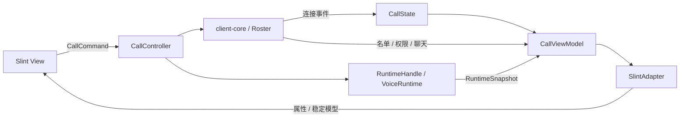

# 通话 UI 的轻量架构

日期：2026-10-03。以 #45 的平台边界和 #41 的通话页重建为基础。

目标是让不同平台复用通话状态和操作规则，同时保持 Slint 的布局、焦点与动效。采用普通 Rust 数据、显式命令和适配器，不引入 MVVM 框架或通用事件总线。

## 各层负责什么

| 层 | 位置 | 职责 |
| --- | --- | --- |
| 连接与服务端状态 | `client-core` | 连接、认证、频道、成员、权限、聊天、控制消息队列 |
| 本地通话状态 | `client-runtime/src/call/state.rs` | Offline / Connecting / Connected / Reconnecting 和恢复提示；不重复保存名单或音频意愿 |
| 操作入口 | `client-runtime/src/call/controller.rs` | 静音、关闭声音、PTT 门控、频道、文本、管理、成员音量、离开；验证当前成员与权限后提交命令 |
| 展示投影 | `client-runtime/src/call/viewmodel.rs` | 将连接阶段、运行快照、名单和音量偏好投影为普通 Rust DTO；不含 Slint、图片或窗口 API |
| 音频运行层 | `client-runtime` | 本地音频意愿、采集 / 播放 / 传输事实、设备生命周期、恢复策略 |
| GUI 适配器 | `client/src/call/adapter.rs` | DTO 转 Slint 字符串 / 属性 / 模型；格式化本地时间；保持模型身份；同步名单、石座和成员菜单 |
| 桌面组合根 | `client/src/main.rs` | 后台连接接线、设备选择、扫描、热键、托盘、身份与设置保存；事件更新状态，回调提交命令 |
| View / 官方篝火 | `client/ui/call/`、`ui/scenes/host.slint`、`src/campfire/` | 布局、断点、焦点、浮层、滚动位置、石座分配、像素图和动效 |

`CallState` 只拥有连接阶段与恢复提示。`Roster` 是服务端成员和权限的来源；`RuntimeHandle` 是本地静音 / 关闭声音 / PTT 意愿的来源；`RuntimeSnapshot` 提供音频事实。`CallViewModel` 每次按这些来源生成，不成为另一份需要双向同步的业务状态。

## 数据流与更新频率

- **按钮**：Slint 回调读取输入参数，提交 `CallCommand`。静音和关闭声音立即作用于 Runtime，再从快照投影界面。加入频道、管理和聊天的实际结果仍由服务端广播更新。
- **连接事件**：桌面桥接先核对当前 Client 身份和加入代次，再修改 `CallState`。重连暂停旧语音，离开清理连接并返回 Offline；界面不参与决定业务阶段。
- **结构变化**：名单事件、权限或音量偏好变化生成完整 `CallViewModel`。适配器按频道 / 成员 ID 区分行，保留同一 `ModelRc`，只通知变化、插入和删除；成员菜单、名单和石座消费同一投影。
- **音频热路径**：通常每 50ms 生成 `AudioViewModel`，不重新遍历名单、格式化聊天或生成图片。更新电平和实际发送状态，只通知活动发生变化的行。PTT 的 20ms 门控读取 Runtime 模式和 `CallState`，不读 GUI 状态。
- **隐藏窗口**：保持恢复检查与托盘更新，沿用后台节流。重新可见时同步当前活动事实。

本地闭麦意愿不从服务端回包或控件读回。管理员禁言独立作用；底栏状态、名单与石座的发送指示使用成功发送的事实。播放故障不掩盖仍在发送的麦克风。重连清除旧会话的输入、UDP 和说话指示；离线试麦仍可显示输入电平。

## 保留在平台侧的状态

成员菜单选中了谁、输入框草稿、当前弹层、设置页是否打开、窗口尺寸与焦点都属于 View。适配器可以读取这些状态更新展示缓存，但业务层不依赖它们决定连接、静音或发送。

首页 / 信任确认 / 加入码流程、设置模型和桌面设备操作仍由现有桌面代码接线。本次范围是通话业务边界；其他平台复用 `CallState`、`CallController`、`CallViewModel`、`client-core` 和 Runtime，另外实现自己的 View、适配器与 `AudioBackend`。

## 验证

以下数字记录架构解耦阶段的定点验证。后续 0.3.0 候选的全工作区、原生窗口、设备与打包结果见 [发布验证记录](release-0.3.0-validation.md)。

纯 Rust 回归覆盖连接阶段、本地意愿与旧回包、服务器禁言、输出故障、重连活动清理、权限、音量身份、PTT 和命令顺序。Slint 适配器回归覆盖模型身份、行标识和实际投影同步。离线预览覆盖现有 80 组布局 / DPI / 状态场景及键盘、指针、焦点。

本机最终 `cargo test -p voice-core -p client-core -p client-runtime -p client --offline`：351 项通过，12 项硬件 / 外网 / 性能专项忽略。工作区全目标 Clippy、格式、SPDX 和差异检查通过。真实 Slint 集成回归还检查音量更新没有结构通知，并验证石座焦点仍可通过 Space 打开同一成员；聊天面板的已读状态观察消息数量，兼容稳定模型。

最终客户端 debug 二进制和 headless 预览重建通过。最新 80 组矩阵及附加交互 / 焦点图共 91 张，与改动前文件逐一比较 SHA-256，全部相同；最终复核产物保存于忽略目录 `target/call-architecture-preview/`，原设计图片和性能记录保持原样。

硬件声卡、多人实时会话、跨屏 DPI 和发布性能仍需实际验收；纯投影与离线 GUI 测试不替代这些检查。
